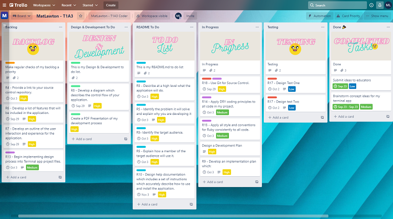

# Welcome to Bone Death Skateboard Academy

This is an assignment for Coder Academy - T1A3 - by Mathew Lawton.

## R4 - My GitHub Repository

Click here to view my GitHub Repository - <https://github.com/Matlawton/coder-academy>

## R5 & R7 - Purpose, Scope & Error Handling

## - Description - What is Bone Death Skateboard Academy?

My terminal app is a booking system for users to interact with and potentially create, view and delete a booking, view camp stats and more at the Bone Death Skateboard Academy. I created a fictional story, use case and then created an issue within this concept to solve.

"Bone Death Skateboard Academy is a world renowned boot camp for turning beginner level skaters into industry leading professionals but they currently do not have a way of booking in new skaters to their campus online.

## - Identify - What is the problem and why is it important to develop a solution?

Online access to a dedicated academic sports facility for everyone, from anywhere.
Skateboarders all across the globe have a lack of facilities that encourage education towards their desired industry as a potential career. Bone Death Academy is currently offering boot camps that turn beginner level skateboarders into industry leaders and professionals but they currently do no have any way for an aspiring student to book a course online.

Developing a solution to this problem is important because creating an online booking system for Bone Death Skateboard Academy will allow aspiring students from all over the world have an opportunity to take part in the courses and boot camps that the academy is offering.

## - Identify - Who is my target audience?

1. Anybody and everybody interested in skateboarding.
1. Industry enthusiasts looking to further their career.
1. Content creators.
1. Sports journalists.
1. Extreme sports enthusiasts.
1. Concerned parents looking for more information.
1. A user who is looking to view or delete an existing booking.

## R5 & R7 - Explain - How will an end user interact with my terminal app and how will errors be handled?

1 - Start program by executing main.rb in the terminal.

2 - A beginning welcome logo which is created using ruby gem tty-font and a message about camp is displayed to the user.

3 - User is prompted to enter if they are an aspiring student or a guardian.

4 - If the end user selects that they are an aspiring student then the app will prompt the user to confirm they are over 16 years of age. There is an age requirement to view and make bookings.
"Are you 16 years of age or older? y/n?(true or false)

5 - If the end user answers 'no' and is not 16 or older, then a new method is called to clear the screen and display a new title logo and message asking the user to have parental/guardian consent before proceeding. The user is prompted to press any key to continue and upon doing so is returned to the main menu. Use of tty-font will be used here.

6 - If the end user has selected they are over the age requirement and/or they are a Guardian, then a brief welcome message and a list of campus history will appear in the terminal such as broken bones, current students, n00bs turned pro, previous students etc.

7 - Then the main booking system menu is displayed to the user where they will have the option to create a booking, view a booking, delete an existing booking, view current number of students enrolled at the end users selected campus plus their semester dates and also a user can view camp information about locations. Use of tty-prompt, colorize and tty-font will be used here.

8 - If the end user selects create a booking, then a list of options in a new menu list will be displayed prompting the end user to enter their name, confirm their age, choose a campus location(only three locations available) and select their semester dates(only two semesters per year). Before continueing, the user will be prompted to confirm their booking information which includes all their details, a booking number reference and the cost of their course. Use of tty-prompt, colorize, tty-font and tty-progress bar will be used here.

9 - Upon confirmation by the user, a receipt will be displayed to the terminal with all the input information provided by the user with a thank you message and the booking menu will be displayed again. Use of tty-prompt, colorize and tty-box will be used here.

11 - The end user will be prompted to press any key to return to main menu or complete booking and end/exit program.

12 - If the user selects main menu and chooses the view a booking option in the menu then their receipt of their previous booking will be displayed along with their booking number reference, their personal details of the booking and the cost.

13 - The end user will be prompted to press any key to return to main menu or complete booking and end/exit program.

14 - If the user selects main menu and chooses the delete a booking option in the menu then their receipt of their previous bookings will be displayed along with their booking number references, their personal details of the booking and the cost.
The user will be prompted to enter the booking reference number of the booking they would like to delete from the system as an integer. The number is displayed on the booking receipt and simply typing in that number will delete the booking.

15 - The end user will be prompted to press any key to return to main menu or complete booking and end/exit program.

16 - If the user selects main menu and chooses the view current number of enrolments option in the menu then a new title logo and the camp stats will be displayed showing the amount of bookings from aspiring students who have created a booking at the same campus and chosen the same semester dates as the current end user.

17 - The end user will be prompted to press any key to return to main menu or complete booking and end/exit program.

18 - If the user selects main menu and chooses the view campus locations option in the menu then a new title logo and the camp information about current and future locations will be displayed.

19 - User will be prompted to press any key to return to main menu or complete booking and end/exit program.

20 - If the end user at any time selects 'exit' from the menu then the program will be terminated.

## R6 - Features

- main.rb is the main file that controls the program

- classes/booking.rb is where I will store all the information about a booking such as the name, age chosen campus and chosen semester dates of the user when prompted.
Booking is a class and inside the class I define methods for storing and accessing data in an array that can be displayed back to the user upon confirming a booking.

- classes/booking_controller is where the main menu operations are stored, initialized and managed. Inside booking controller I first created a class and then defined methods for managing while loops, when statements and case statements to hold information for the program to call upon at a given time that will then be displayed to the end user.
Booking controller manages the control flow of the main menu and directs an end user of the app towards their desired goal. Booking control also manages the error handling for users who are not over the age of 16 in two seperate occasions throughout the app. It also handles incorrect responses to other answers input by the end user through out the application.
If there is no booking currently created then specific title screens and messages are displayed to the user on the view a booking screen, delete a booking and the view current enrolments screen to direct the user back to the main menu where they will be able to create a booking.

- classes/location.rb is where I store all the information about campus locations, current available locations and future locations that are under construction. I keep all of this information inside a Locations Class that I call upon through out the app to be displayed to the end user when and if required.

- utilities/camp_stats.rb is where I will store all the information about the camp stats and info about current and future campus locations

- utilities/titles.rb holds the specific titles for each screen or prompt such as the welcome screen, the camp stats screen, the message that is displayed when a user is not over the age of 16 and the exit screen to say good bye.

## R8 - Control Flow Diagram

I started my control flow design process with pen and paper to get the basic concepts out of the way.

I used [diagrams.net](https://www.diagrams.net) to create the control flow diagram below.

## R9 - Project Management - Trello

I used [Trello](https://www.trello.com) to organise my design and development process and tasks at hand. I set priorities and deadlines for each task so I could track them along the way.
To begin, I started with a Trello workspace and then I implimented a Kanban template into my workspace, from there I installed a power up extension within trello titled 'Card Priority", which allowed me to be able to set deadlines for each card or task. I used [Canva](https://www.canva.com) for the title images.

Here are some examples of how my Trello board was used at different sections throughout my development.

*Friday the 24th of September.*

*Friday the 1st of October.*

*Monday the 4th of October.*

## R10 - Instructions - Installing and using the app

To use my terminal app you will need to install ruby on your PC. [You can download ruby here.](https://www.ruby-lang.org/en/)

You also need to have the 'Bundler' gem installed on your PC. It comes with the main ruby installation as above, but if you don't have it on your machine, you can install the bundler gem by executing the following command in your terminal:
gem install bundler

Once you have done the above, you can either clone or fork this repository onto to your local machine(your PC).
To install the required gems I am using for this app, make your way to the /src folder in the repostitory on your computer, and use the command:
bundle install

Furthermore, you can view the gems I am using by opening the 'Gemfile' located in the /src folder

Finally when everything above is completed, you can run the app by typing the following command into your terminal:
ruby main.rb

## R17 - Testing

18 - EXTRAS
    - Future locations to feature written information.
    - Extra Activities + cost
    - Edit a booking
    - Update the show reel of stats
    - Give an option to return to the previous screen
    - Provide login authentication and a back end for users to log in
    - Provide an option to pay for the course via the app
    - Change text colors and title colors using gem pastel

